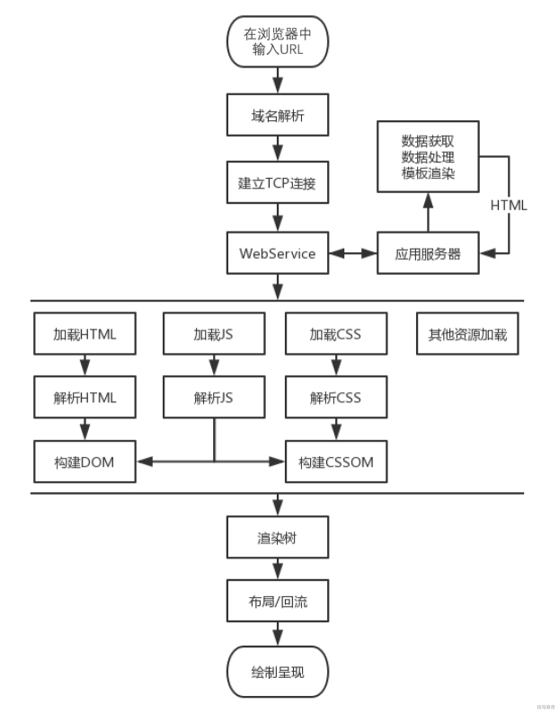

# Performance

## Web 性能

Web 性能是网站或者应用程序可感知的用户体验

### 怎么提升性能

- 减少整体加载时间：减小文件体积，减少 HTTP 请求，使用预加载

- 使网站尽快可以交互：仅加载首屏内容，其他内容懒加载

- 流畅的交互：使用 css 替代 js 动画，减少 UI 重绘

- 用户感觉：页面可能不能更快了，但是可以让用户感觉更快，耗时操作要给用户反馈

- 性能测定：性能指标，性能测试，性能监控持续优化

### 生命周期

### [Web 性能指标](./性能指标.md)

### Web 性能测试

- lighthouse

- [WebPageTest](https://www.webpagetest.org/) 

- chrome 任务管理器

### 性能监控

- http://www.alloyteam.com/2020/01/14184/

- https://juejin.cn/post/6844904094616780813

- https://cloud.tencent.com/developer/news/682347

- https://www.infoq.cn/article/dxa8am44oz*lukk5ufhy

- https://www.zhihu.com/question/37585246

---

## [请求和响应优化](./请求和响应优化.md)

