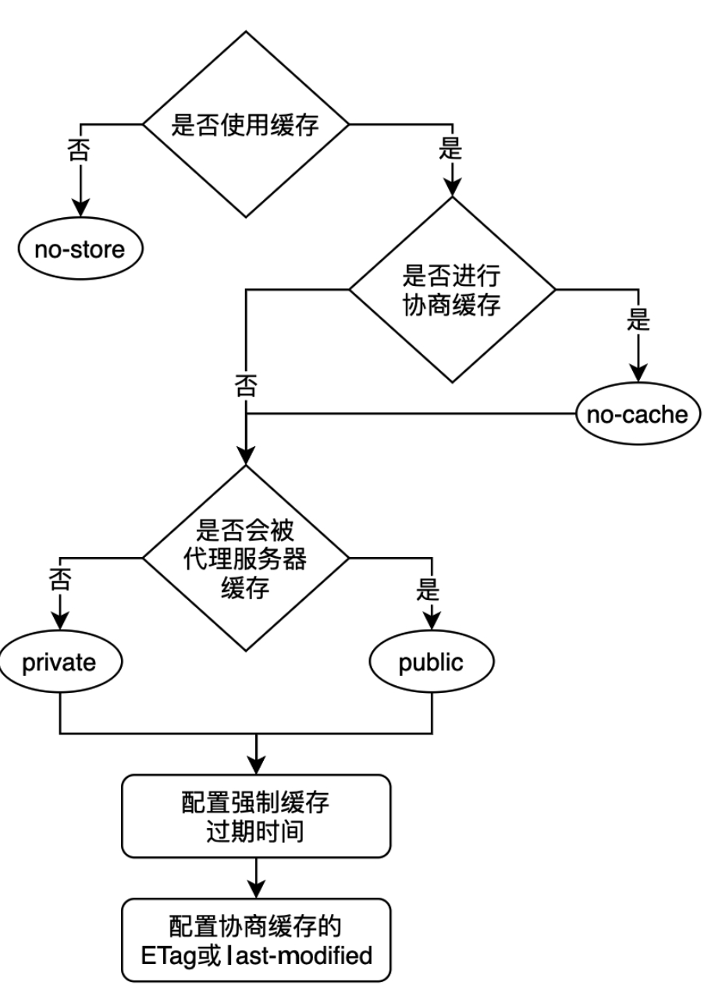

## HTTP2

### 二进制协议

HTTP 1.1 头信息是 ascll 编码，数据体可以是文本，也可以是二进制，但是 HTTP 2 是一个彻底的二进制协议

### 多工

HTTP 2 复用 TCP 连接，在一个连接里，客户端和浏览器可以同时发布多个请求或者回应，而且不用按照顺序一一对应，这样就避免了队头阻塞

[在线示例](https://http2.akamai.com/demo)

### 数据流

- 因为 HTTP2 不是按照顺序响应的，每个请求和响应里面所有的数据包视为一个流，每个数据流都有唯一的标识，另外还规定客户端发出的数据流 ID 一律为奇数，服务端一律为偶数

- 数据流的取消，1.1版本需要关闭 TCP 连接，2可以取消某一个请求，同时 TCP 连接继续保持，可以被其他请求使用

- 客户端可以指定数据流的优先级，优先级越高，服务端会更快响应

- 头部信息进行压缩后再发出

- 允许服务器主动推送内容，就比如用户访问一个地址，服务器可以把这个地址里面所用的资源全部返回，也就是一个请求可以对应多个响应

---

## HTTP 缓存

### 强制缓存

- expires

  - 指定缓存过期的时间，但是如果服务器和客户端时间不一样，或着资源已经更新，这样都是没办法处理的

- cache-control: max-age=xxx

  - 可以设置多长时间后过期

### 协商缓存

就是在使用本地缓存之前，向浏览器发送一次 get 请求，协商缓存是否已经过期，通常是采用请求资源最近的修改时间来判断的，强制缓存优先与协商缓存

#### last-modified 和 if-modified-since

- 假设客户端要请求一个图片，为了进行协商缓存，那么该请求第一次请求要返回 last-modified 字段，当刷新网页的时候，浏览器无法确定这个请求是本地缓存还是其他，所以先去向服务器发送一个 get 请求，服务器根据 if-modified-sence 判断文件是否被修改过，如果没修改，浏览器就使用本地缓存，使用过服务器就返回新的资源

- 要注意的是协商缓存的有效状态是 304，就是缓存重新定向到本地，对于强制缓存来说如果有效的话，状态码是 200

#### last-modified 不足

- 如果请求的文件资源发生了编辑，但是内容没有改变，时间戳也会更新

- 识别文件资源修改的时间精确到秒，如果文件资源修改时间非常快的话是没有办法识别到资源已经更新了

#### ETAG

为了弥补 last-modified 的不足，http 1.1 制定了 etag，主要是针对不同资源进行哈希运算进行更精确的变化感知，如果和 last-modified 同时存在，etag 的优先级别更高，和 last-modified 一样，在第二次发送请求的时候浏览器会把第一次的 etag 作为 if-none-match 发过去，若缓存验证有效，那么状态码会变成 304，重新指向到本地缓存

不足之处：

- 服务器生成 etag 的运算是有一定开销的，如果文件的修改过于频繁，或者资源的内容过大都会影响性能

- etag 也分为强验证和弱验证，强验证根据内容生成，能保证每个字节相同，弱验证根据部分字节来生成，但无法保证每个字节都相同

#### 缓存过程

---

### cache-control

- max-age：多长时间后过期

- s-maxage：表示在代理服务器中的缓存时间，仅在设置 public 时候生效

- no-cache：不是不缓存，是强制进行协商缓存，就是每次浏览器发请求不用去判断请求是否已经过期，而是通过协商来解决

- no-store：表示禁止任何缓存策略，客户端每次请求都要服务器给全新的响应，与 no-cache 互斥

- public：表示既可以被浏览器缓存，也可以被代理服务器缓存

- private：只能被浏览器缓存，默认为 private，与 public 互斥

---

## Service Worker 缓存

独立于浏览器主线程之外的工作线程，所以他不会影响浏览器的渲染，Service Worker 是基于 Web Worker 之上增加了对离线缓存的管理能力

基本特征：

- 独立于浏览器主线程，无法直接操作 DOM

- 部署到线上需要 HTTPS

- 能够监听网站的网络请求，从而进行自定义控制

- 不是用的时候会被终止，需要的时候需要重启，所以我们也可以在 indexDB 存储状态

- 广泛使用 promise 来处理异步

- 消息推送

- 后台同步

## CDN 缓存

内容分发网络，他是构建在现有网络基础之上的虚拟智能网络，部署在各地区的服务器，通过智能调度，可以返回给用户距离最近的响应

## 避免重定向

## 使用服务端渲染